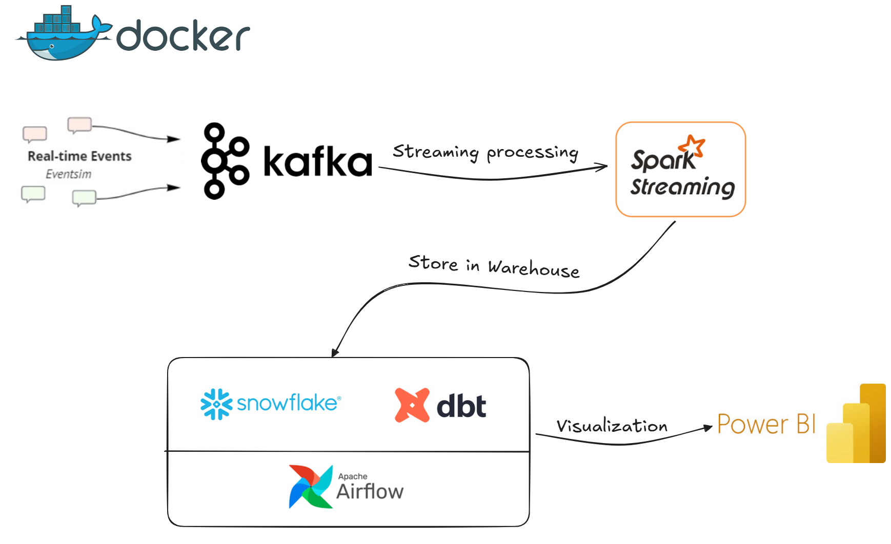

# Streamify

Streamify is a real-time data streaming and analytics platform built with   **Apache Kafka**, **Apache Spark Streaming**, **Snowflake**, **dbt**, and **Airflow**.  

It enables real-time data ingestion, transformation, and analytics with a modern data engineering stack.

---

## Dataset

[Eventsim](https://github.com/Interana/eventsim) is a program that generates event data to replicate page requests for a fake music web site. The results look like real use data, but are totally fake. The docker image is borrowed from [viirya's fork](https://github.com/viirya/eventsim) of it, as the original project has gone without maintenance for a few years now.

Eventsim uses song data from [Million Songs Dataset](http://millionsongdataset.com) to generate events. I have used a [subset](http://millionsongdataset.com/pages/getting-dataset/#subset) of 10000 songs.

---

## 🛠️ Tech Stack
- [Apache Kafka](https://kafka.apache.org/) – streaming message broker  
- [Apache Spark](https://spark.apache.org/) – real-time data processing  
- [Apache Airflow](https://airflow.apache.org/) – workflow orchestration  
- [Snowflake](https://www.snowflake.com/) – cloud data warehouse  
- [dbt](https://www.getdbt.com/) – analytics engineering & modeling  
- [Docker](https://www.docker.com/) & Docker Compose – containerization  

---

## 📂 Architecture

  

---

## 📊 Results

  

---

