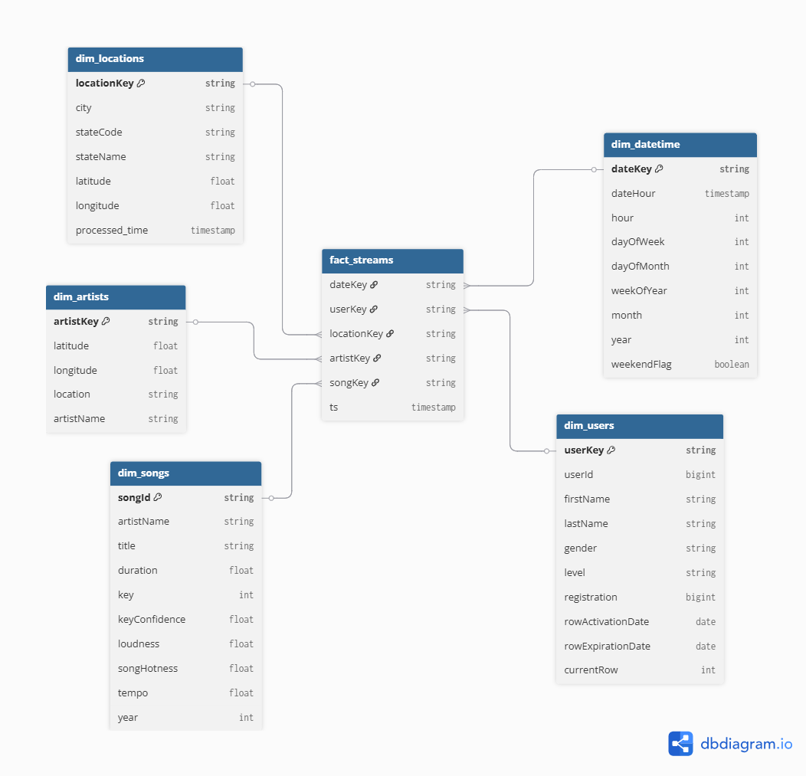
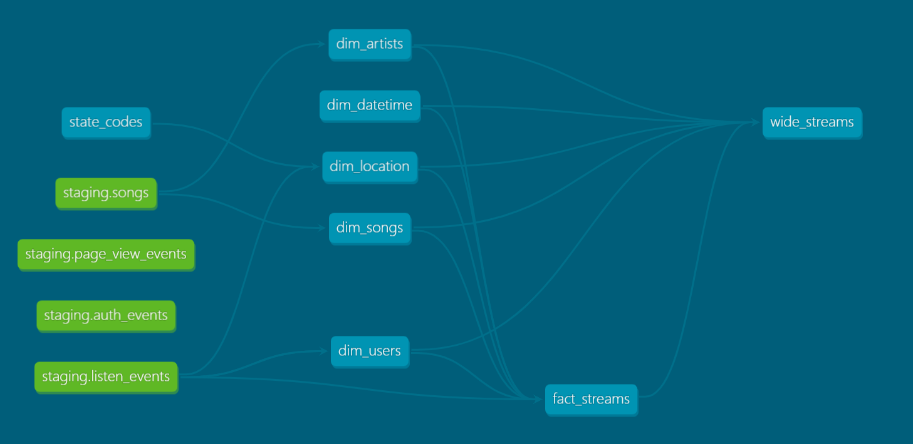

# Streamify: End-to-End Music Event Data Platform

Streamify is a comprehensive data engineering project that demonstrates a full, end-to-end data pipeline. It simulates, processes, and analyzes real-time music streaming events, transforming raw data into actionable business intelligence.

This platform captures simulated user interactions (like 'song played' or 'artist listened to'), processes them in real-time, stores them in a modern data warehouse, models them for analytics, and finally visualizes the resulting insights.

-----

## 💾 Dataset

[Eventsim](https://github.com/Interana/eventsim) is a program that generates event data to replicate page requests for a fake music website. The results look like real use data but are completely synthetic.

The Docker image is borrowed from [viirya's fork](https://github.com/viirya/eventsim), as the original project is unmaintained. Eventsim uses song data from the [Million Songs Dataset](http://millionsongdataset.com); this project uses a [subset](http://millionsongdataset.com/pages/getting-dataset/#subset) of 10,000 songs.

---

## 📈 Project Architecture & Data Flow

  
</p\>

The project follows a modern data stack (ELT) architecture, composed of six main stages:

1.  **Data Simulation (Eventsim):** Real-time music event data (e.g., page views, song plays) is generated using **[Eventsim](https://github.com/Interana/eventsim)** to simulate a real-world user base.
2.  **Ingestion & Messaging (Kafka):** The raw event data is captured by **Apache Kafka**, which acts as a highly reliable and scalable distributed event store.
3.  **Real-Time Processing (Spark Structured Streaming):** **Apache Spark** connects to the Kafka topic, consuming the event stream in real-time. It performs crucial cleaning and transformation before writing the data into the data warehouse.
4.  **Cloud Data Warehouse (Snowflake):** **Snowflake** serves as the central data warehouse, providing a scalable "single source of truth" for all processed data from Spark.
5.  **Data Transformation (dbt):** Once the data is in Snowflake, **dbt (data build tool)** runs transformation jobs directly within the warehouse to convert the data into a clean, analytics-ready **star schema**.
6.  **Orchestration (Airflow):** **Apache Airflow** manages the workflow, orchestrating the dbt transformations on a daily schedule to keep the analytical models up-to-date.
7.  **Business Intelligence (Power BI):** Finally, **Power BI** connects to Snowflake, consuming the clean data from the star schema to visualize insights through interactive dashboards.

---

## 🗂️ Data Modeling & Transformation (dbt)

This project uses dbt to manage and execute two main types of data models in Snowflake:

1.  **Star Schema:**
    * This is the primary, normalized storage model.
    * It consists of one central fact table (`fact_streams`) and five dimension tables (`dim_users`, `dim_songs`, `dim_artists`, `dim_locations`, `dim_datetime`).
    * This structure is highly efficient for storage, maintaining data integrity, and avoiding redundancy.

  
</p\>

2.  **Wide Table (`wide_streams`):**
    * This is a wide, denormalized table/view built *from* the star schema.
    * **Purpose:** To provide a single, "flattened" table for BI tools (like Power BI).
    * **How it works:** It pre-joins the `fact_streams` table with all five dimension tables.
    * **Benefits:** By performing the JOINs in advance, this model simplifies queries in Power BI, significantly improves dashboard loading speeds, and makes it easier for end-users to self-analyze data without needing to understand complex relationships.

  
</p\>

-----

## 📊 Results Dashboard

Visualizations are created in Power BI, connected directly to the star schema models in Snowflake.

  
</p\>

-----
